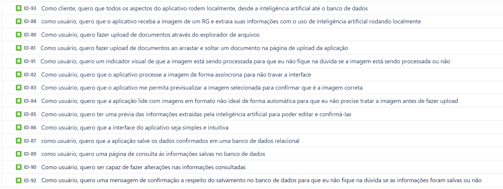

**IdScan** é um aplicativo de processamento de imagens de documentos de identidade (RG) sem o uso de APIs externas e armazenamento desses dados em um banco de dados MySQL local. Ele foi projetado para facilitar a digitalização, extração e organização de informações contidas em documentos físicos, tornando o gerenciamento de dados mais eficiente.

## Objetivo

Desenvolvimento de um aplicativo Java Desktop, utilizando modelos de Inteligência Artificial para a extração de informações de documentos de identidade (RG) e postrior armazenamneto e edição em um banco de dados relacional (MySQL). **Todas** as operações do aplicativos acontecem localmente, desde o processamento com IA até as operações com o banco de dados.

## Demonstração
Breve vídeo demonstrativo do aplicativo:

### Manual do usuário:
[Clique para a cessar o manual de instalção e de uso](/docs/manual_do_usuario.md)

## Download do aplicativo:
https://github.com/Titus-System/2semestre-ADS/releases

## Tecnologias utilizadas no desenvolvimento do projeto

  
  
  
  
  
  
  
  
  

- Java: Linguagem de programação para desenvolvimento do aplicativo
- MySQL: Banco de dados
- Ollama: Framework para rodar LLMs e LVMs localmente
- Tesseract OCR: Reconhecimento ótico de caracteres para leitura do documento
- Git e Github: Versionamento de software
- Jira: Gerenciamento do projeto
- Figma: Previsualização do design das páginas

## Backlog

## Cronograma

| Sprint              | Previsão      | Status       |
|---------------------|---------------|--------------|
| Kick Off            | 29/08/2024    | Finalizada    |
| 01                  | 09/09/2024    | Finalizada    |
| 02                  | 30/09/2024    | Finalizada |
| 03                  | 21/10/2024    | Finalizada      |
| 04                  | 11/11/2024    | Finalizada     |

## *Sobre a Equipe*

|Integrantes                |  Cargo      |   GIT HUB                           |  Linkedin                                                      |
|---------------------------|-------------|-------------------------------------|----------------------------------------------------------------|
| Pedro Felipe Sousa Garcia |Product owner| <https://github.com/pedro-fs-garcia>|<https://www.linkedin.com/in/pedro-fs-garcia>                   |
| Ágatha Wei Alves          |Scrum Master | <https://github.com/Agathawei070>   |<https://www.linkedin.com/in/agatha-wei>                        |
| Julia Coêlho Santiago     |Dev Team     | <https://github.com/juliasantiaggo> |<https://www.linkedin.com/in/juliacoelhosantiago>               |
| Julia Soares Pereira      |Dev Team     | <https://github.com/juliasoares17>  |<https://www.linkedin.com/in/julia-soares-pereira-9ab79830b>    |
| Alice Azambuja Alves      |Dev Team     | <https://github.com/Tiny-Mushroom>  |<https://www.linkedin.com/in/alice-alves-84075130a>             |
| Karina Rodrigues Ribeiro  |Dev Team     | <https://github.com/karinaribeiro2> |<https://www.linkedin.com/in/karina-rodrigues-ribeiro-327562216>|
| Eduardo Fonseca Ribeiro   |Dev Team     | <https://github.com/eduardo-Rib>    |<https://www.linkedin.com/in/eduardo-ribeiro-4b78002b2>         |
| Guilherme Henrique Cassula|Dev Team     | <https://github.com/Guih0412>       |<https://www.linkedin.com/in/guilherme-henrique-36b3a0220>      |

