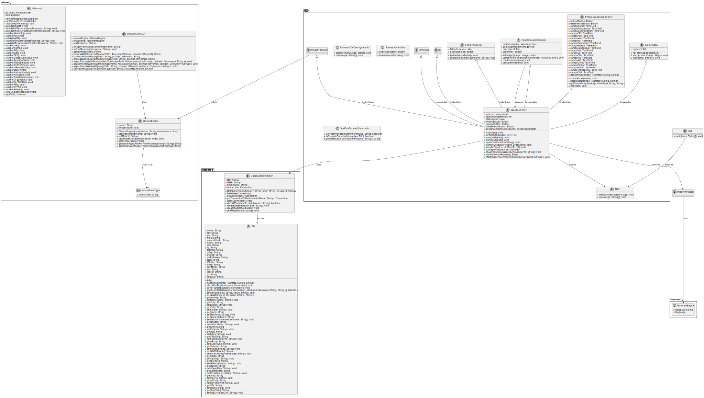
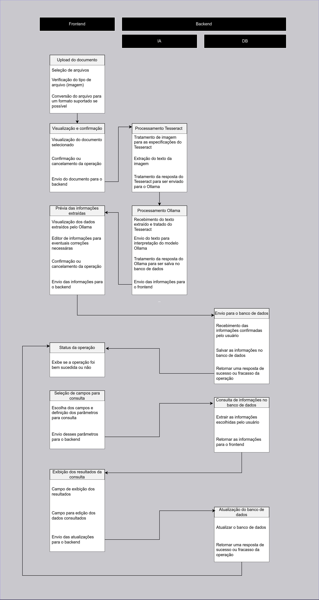
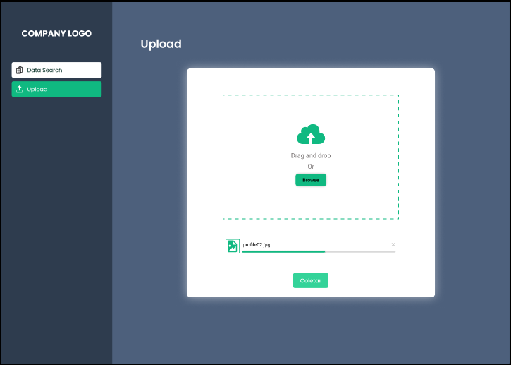
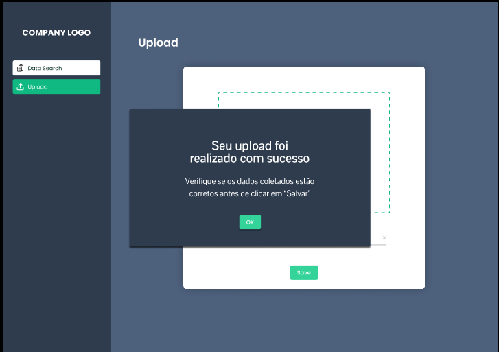
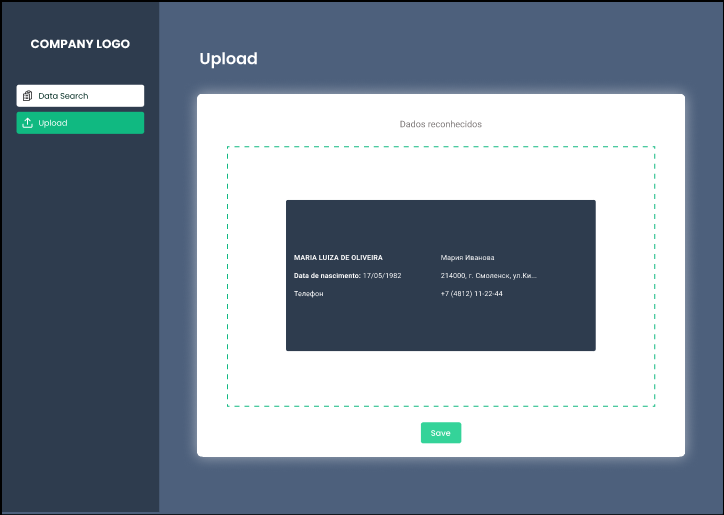
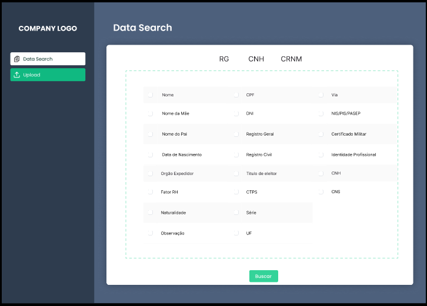
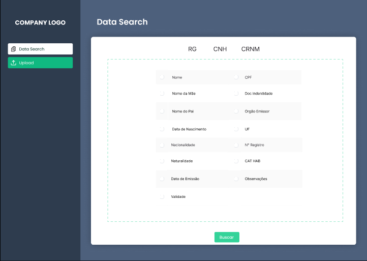
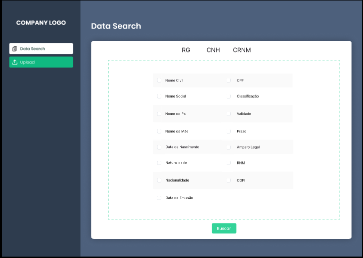

# Documentação do projeto

## UML

## Fluxo de trabalho do aplicativo

## Protótipo
### LINK
https://www.figma.com/proto/OyTwLIwDQOBRMcyUElUK7m/ID-Scan?node-id=8-169&node-type=canvas&t=LqhCG9oleu0KWKCg-1&scaling=contain&content-scaling=fixed&page-id=0%3A1&starting-point-node-id=8%3A169

