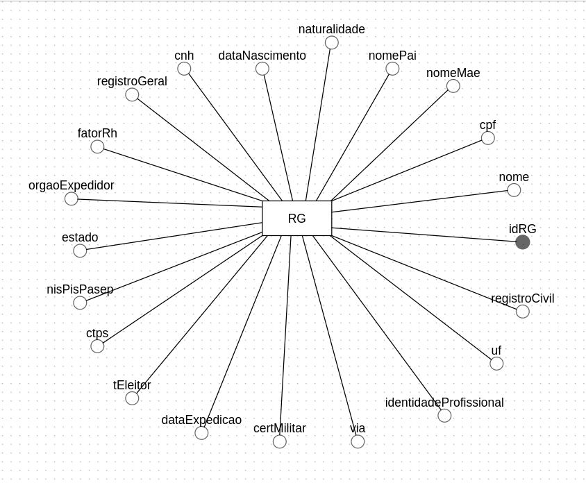
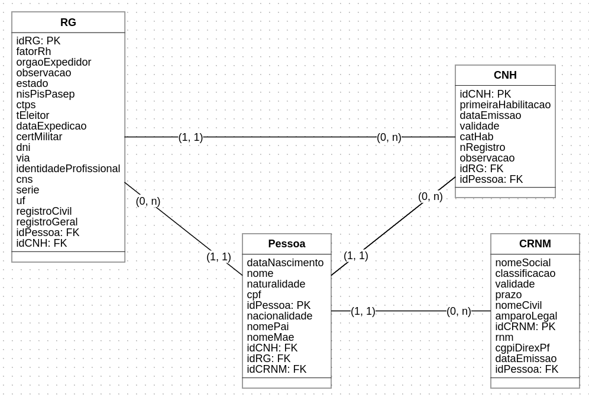

# Modelos

## Conceitual e Lógico




## Modelo Físico

``` sql
create database idScan;

use idScan;

create table RG (
naturalidade varchar(45),
nomePai varchar(100),
nomeMae varchar(100),
nome varchar(100),
cpf varchar(45),
dataNascimento varchar(45),
idRG int primary key auto_increment not null,
fatorRh varchar(45),
orgaoExpedidor varchar(100),
estado varchar(45),
nisPisPasep varchar(100),
ctps varchar(45),
tEleitor varchar(45),
dataExpedicao varchar(45),
certMilitar varchar(45),
via varchar(45),
identidadeProfissional varchar(45),
uf varchar(45),
registroCivil varchar(45),
registroGeral varchar(45)
);

```
