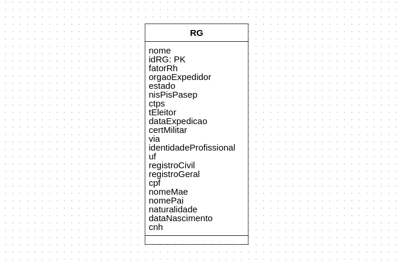

# Modelos

## Conceitual e Lógico




## Modelo Físico

``` sql
create database idScan;

use idScan;

create table Pessoa ( 
    idPessoa int primary key auto_increment not null,
    dataNascimento varchar(45),
    nome varchar(100),
    cpf varchar(45),
    nacionalidade varchar(45),
    naturalidade varchar(45),
    nomePai varchar(100),
    nomeMae varchar(100),
    idCNH int,
    idRG int,
    idCRNM int
);

create table RG (
    idRG int primary key auto_increment not null,
    fatorRh varchar(45),
    orgaoExpedidor varchar(100),
    observacao varchar (200),
    estado varchar(45),
    nisPisPasep varchar(100),
    ctps varchar(45),
    tEleitor varchar(45),
    dataExpedicao varchar(45),
    certMilitar varchar(45),
    dni varchar(45),
    via varchar(45),
    identidadeProfissional varchar(45),
    cns varchar(45),
    serie varchar(45),
    uf varchar(45),
    registroCivil varchar(45),
    registroGeral varchar(45),
    idPessoa int,
    idCNH int
);

create table CNH(
    idCNH int primary key auto_increment not null,
    primeiraHabilitacao varchar(45),
    dataEmissao varchar(45),
    validade varchar(45),
    catHab varchar(45),
    nRegistro varchar(45),
    observacao varchar(200),
    idRG int,
    idPessoa int
    
);

create table CRNM (
    idCRNM int primary key auto_increment not null,
    nomeSocial varchar(45),
    classificacao varchar(45),
    validade varchar(45),
    prazo varchar(45),
    nomeCivil varchar(45),
    amparoLegal varchar(45),
    rnm varchar(45),
    cgpiDirexPf varchar(100),
    dataEmissao varchar(45),
    idPessoa int
);

alter table RG add foreign key(idPessoa) references Pessoa (idPessoa);
alter table RG add foreign key(idCNH) references CNH (idCNH);

alter table  Pessoa add foreign key(idCNH) references CNH (idCNH);
alter table Pessoa add foreign key(idCRNM) references CRNM (idCRNM);
alter table Pessoa add foreign key(idRG) references RG (idRG);

alter table  CNH add foreign key(idRG) references RG (idRG);
alter table CNH add foreign key(idPessoa) references Pessoa (idPessoa);

alter table CRNM add foreign key(idPessoa) references Pessoa (idPessoa);
```
